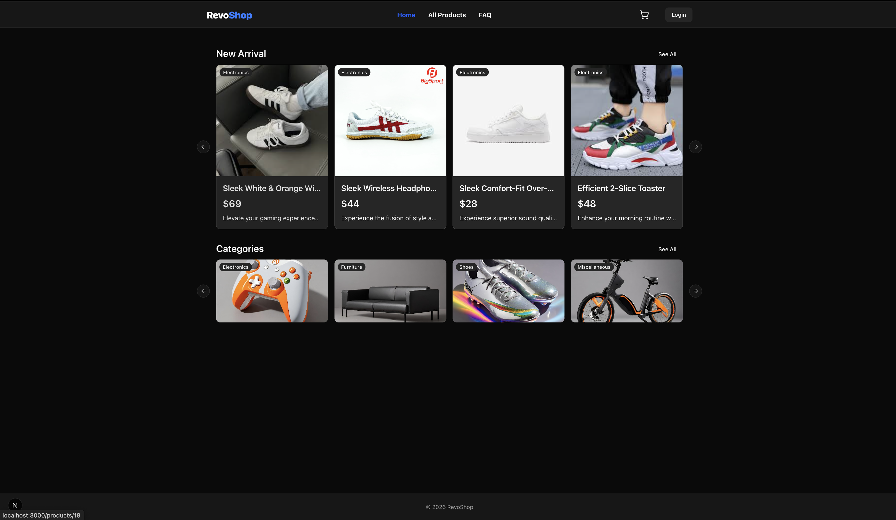
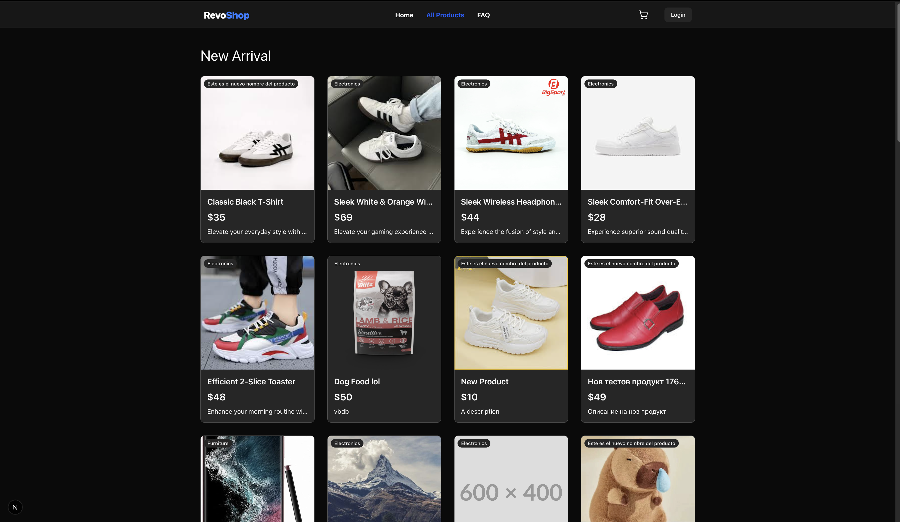
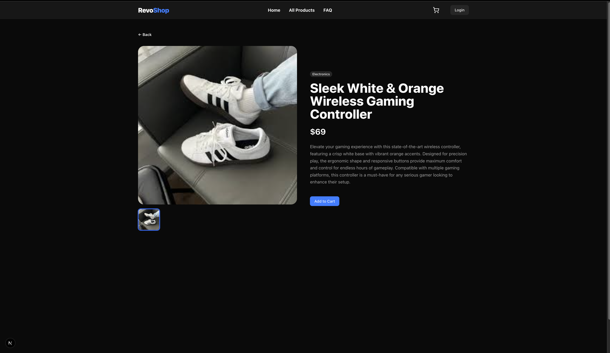
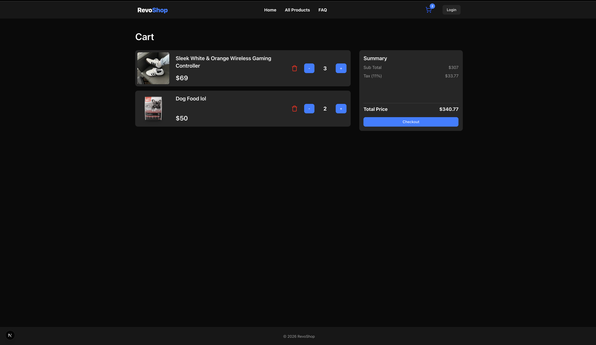
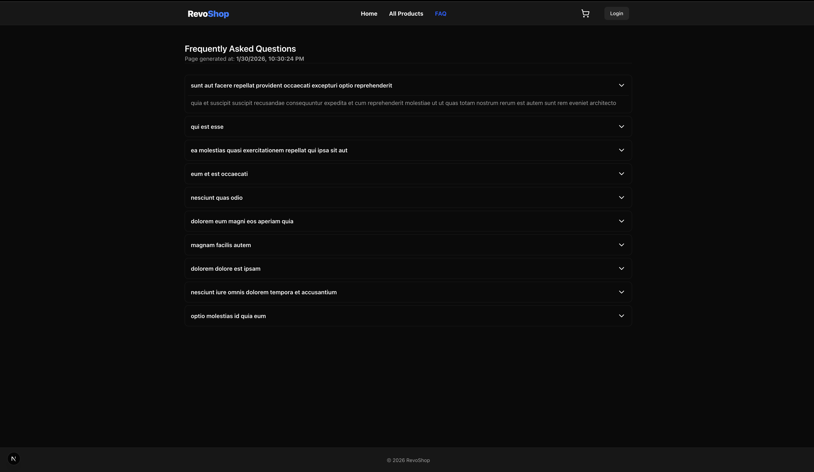

# RevoShop

## Overview

RevoShop is a simple e‑commerce demo built with Next.js App Router. It showcases product listing, product detail with server‑side rendering, a client‑side cart, and a statically generated FAQ page. The UI uses Radix UI primitives and Tailwind for styling.

## Screenshots

Home


Products


Produc Detail


Cart


FAQ


## Features

- Home highlights new arrivals and categories
- All Products grid with images, names, prices, and navigation to detail
- Product Detail page rendered with SSR (server fetch, gallery, category, price, description)
- Add to Cart and quantity controls; cart summary and item removal
- FAQ page statically generated (SSG) with cached fetch
- File‑based routing and client‑side navigation via Next.js Link

## Tech Stack

- Next.js 16 (App Router, server components, SSR/SSG)
- React 19 and TypeScript
- Tailwind CSS 4
- Radix UI and lucide‑react icons
- Embla Carousel (autoplay) for carousels
- Axios and Fetch API for data fetching
- LocalStorage utilities for cart/auth persistence

## Deployed Website

[Link](https://milestone-3-khankhanfauzan.vercel.app/)

## Folder Structure

```
.
├─ README.md
├─ .gitignore
├─ bun.lock
├─ components.json
├─ next.config.ts
├─ package.json
├─ postcss.config.mjs
├─ tsconfig.json
├─ public/
│  ├─ file.svg
│  ├─ globe.svg
│  ├─ next.svg
│  ├─ vercel.svg
│  └─ window.svg
└─ src/
   ├─ app/
   │  ├─ categories/
   │  │  └─ [id]/
   │  │     └─ page.tsx
   │  ├─ cart/
   │  │  └─ page.tsx
   │  ├─ faq/
   │  │  └─ page.tsx
   │  ├─ dashboard/
   │  │  └─ page.tsx
   │  ├─ login/
   │  │  └─ page.tsx
   │  ├─ products/
   │  │  ├─ [id]/
   │  │  │  └─ page.tsx
   │  │  └─ page.tsx
   │  ├─ favicon.ico
   │  ├─ globals.css
   │  ├─ layout.tsx
   │  └─ page.tsx
   ├─ components/
   │  ├─ AddToCartAction.tsx
   │  ├─ AppSidebar.tsx
   │  ├─ BackButton.tsx
   │  ├─ CartCard.tsx
   │  ├─ CategoryCard.tsx
   │  ├─ CategoryCarousel.tsx
   │  ├─ FAQCard.tsx
   │  ├─ Footer.tsx
   │  ├─ HomeCarousel.tsx
   │  ├─ Loading.tsx
   │  ├─ NavBar.tsx
   │  ├─ ProductCard.tsx
   │  ├─ ProductGallery.tsx
   │  ├─ SafeImage.tsx
   │  └─ ui/..
   ├─ hooks/
   │  ├─ use-mobile.ts
   │  └─ useCart.ts
   ├─ lib/
   │  └─ utils.ts
   ├─ services/
   │  ├─ api.ts
   │  └─ storage.ts
   └─ types/
      ├─ auth.ts
      ├─ faq.ts
      ├─ param.ts
      └─ product.ts
```
